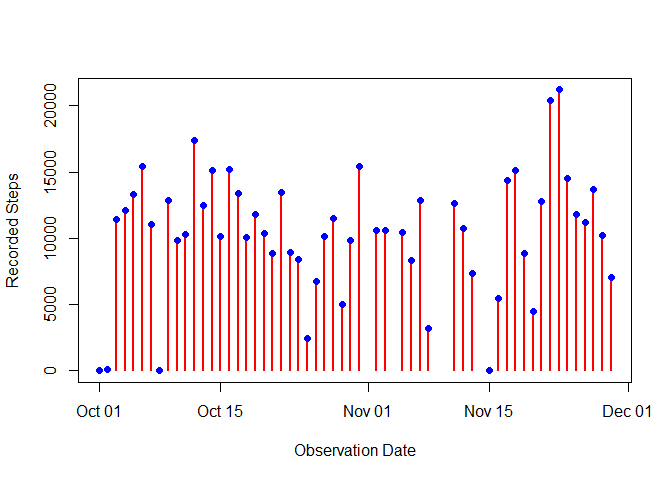
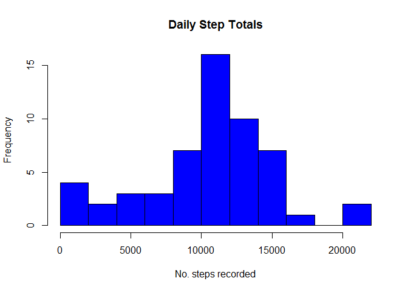
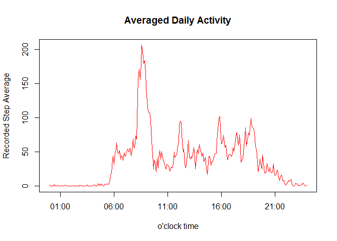
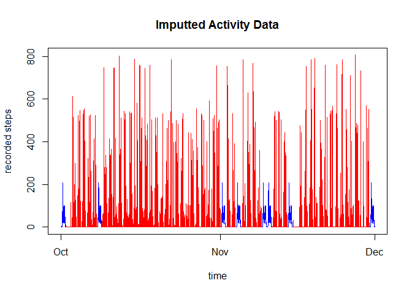
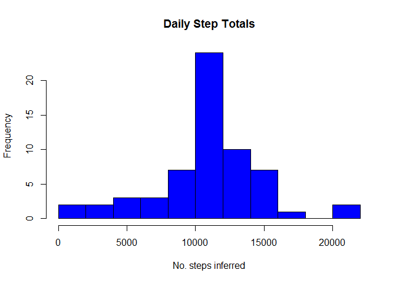
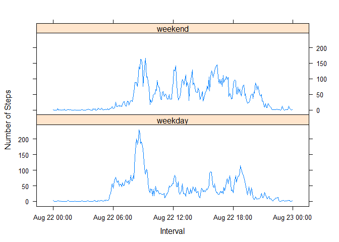

# Course Project 1
D.McCabe  


# Introduction


This report uses [activity monitoring data](https://d396qusza40orc.cloudfront.net/repdata%2Fdata%2Factivity.zip) taken at (2017-08-22).


```r
# prepare libraries etc...
library(data.table)
set.seed(71675)

### DECLARING SOME HELPER FUNCTIONS UP HERE ###

# helper function for padding time strings to %H%M format
pad0000<-function(x){
  paste0(paste0(rep("0",4-nchar(x)),collapse=""),collapse="",x)
}

# helper function for getting hour from POSIXct - takes a time& date object returns hours on the clock
hour<-function(x){
  as.POSIXlt(x)$hour
}

# helper function for getting min from POSIXct - takes a time&date object returns minutes on the clock
min<-function(x){
  as.POSIXlt(x)$min
}

# helper function determines if time is on a weekend - takes a time&sdate object returns a boolean
weekend<-function(time){
  wday<-weekdays(time)
  return((wday=="Saturday")||(wday=="Sunday"))
}

# helper function for dropping date from POSIXct - takes the time&date object - retuns a time object (kind of)
clocktime<-function(datetime){
  as.POSIXct(               # create a new POSIXct
    paste(                  # using only the
      hour(datetime),       # hour and
      minute(datetime),     # minute of old POSIXct
      sep="-"
    ),
    format = "%H-%M"
  )
}
```


## Loading and preprocessing the data

### 1. Load the data (i.e. *read.csv()*)


```r
# will try using data.table for a change.
data_raw<-fread(file="activity.csv")
```


### 2. Process/transform the data (if necessary) into a format suitable for your analysis


```r
# get the refined the raw data
data_clean<-data_raw[       # Take the raw data...
  ,                         # for every row
  .(                        # merge each date and time recording into a POSIXct object
    steps,
    time = as.POSIXct(
      paste(date, sapply(interval,pad0000), sep="|"),
      format = "%F|%H%M"
    )
  )
][
  order(time)               # Ensure chronological ordering - sanity check
]
```


## What is mean total number of steps taken per day?

### 1. Calculate the total number of steps taken per day


```r
# use helper function to get step totals for each day
step_total<-data_clean[           # Take data_clean...
  !is.na(steps),                  # exclude any missing observations
  .(                              # then calculate...
    steps = sum(steps)            # - calculate the total steps
  ),  
  .(date = as.Date(time))         # for each date (year day)
]
```
<!-- -->


### 2. Make a histogram of the total number of steps taken each day


```r
# print a simple histogram to the graphics device
hist(
  step_total$steps,
  breaks = 8,
  col = "blue",
  main = "Daily Step Totals",
  xlab = "No. steps recorded"
)
```

<!-- -->

### 3. Calculate and report the mean and median of the total number of steps taken per day


```r
# calculate the number of steps for each day
step_total[
  ,                        # for all observations
  .(
    mean=mean(steps),      # calculate the mean steps
    median=median(steps)   # calculate the median steps
  )
]
```

```
##        mean median
## 1: 10374.69  10600
```


## What is the average daily activity pattern?

### 1. Make a time series plot (i.e.*type = "l"*) of the 5-minute interval (x-axis) and the average number of steps taken, averaged across all days (y-axis)


```r
# get average activity dsta
activity_data<-data_clean[
  !is.na(steps),                     # excluding missing data
  .(                                 # calculate...
    clocktime=clocktime(time),       # - time of day
    steps                            # - steps
  )
][
  ,                                  # for all data
  .(                                 # calculate...
    mean_steps = mean(steps)         # - average steps
  ),
  .(                                 # grouping by...
    clocktime                        # - time of day
  )      
]
```


```r
# plot activity
plot(
  x=activity_data$clocktime,
  y=activity_data$mean_steps,
  main = "Averaged Daily Activity",
  xlab = "o'clock time",
  ylab = "Recorded Step Average",
  type="l",
  col="red"
  
)
```

<!-- -->

### 2. Which 5-minute interval, on average across all the days in the dataset, contains the maximum number of steps?

```r
activity_data[which.max(mean_steps),]$clocktime
```

```
## [1] "2017-08-22 08:35:00 BST"
```


## Imputing missing values

### 1. Calculate and report the total number of missing values in the dataset (i.e. the total number of rows with *NA*s)


```r
data_clean[is.na(steps),.N]
```

```
## [1] 2304
```

### 2. Devise a strategy for filling in all of the missing values in the dataset.

Previously any observations that were missing data were used removed before calculate the average number of steps at each clock time, this is the **activity_data**.  Now any missing data points are replaced with the average observed steps recorded for the corresponding clock time (in activity_data).

###3. Create a new dataset that is equal to the original dataset but with the missing data filled in.


```r
# imput function returns specified steps or mean daily steps for NA
imput<-function(steps,time){
  
  # helper function - get average steps for a given time
  getStepAverage<-function(time){return(activity_data[clocktime(time)==clocktime]$mean_steps)}

  # replace missing steps with average steps for corresponding time
  steps[is.na(steps)] <- sapply(time[is.na(steps)],getStepAverage)
  
  return(steps)
}

data_imputted<-data_clean[
 ,
 .(
   time,
   steps=imput(steps,time)
 )
]
```

Now with the NA's replaced by reasonable values we can plot the data.


```r
plot(
  x=data_imputted$time,
  y=data_imputted$steps,
  type="l",
  col="blue",
  main = "Imputted Activity Data",
  xlab = "time",
  ylab = "recorded steps"
)
lines(
  x=data_clean$time,
  y=data_clean$steps,
  type="l",
  col="red"
)
```

<!-- -->

###4 Make a histogram of the total number of steps taken each day and Calculate and report the *mean* and *median* total number of steps taken per day


```r
imputted_step_total<-data_imputted[
  ,
  .(steps=sum(steps)),
  .(date=yday(time))
]

# print a simple histogram to the graphics device
hist(
  imputted_step_total$steps,
  breaks = 8,
  col = "blue",
  main = "Daily Step Totals",
  xlab = "No. steps inferred"
)
```

<!-- -->

### 3. Calculate and report the mean and median of the total number of steps taken per day


```r
# calculate the number of steps for each day
imputted_step_total[
  ,                        # for all observations
  .(
    mean=mean(steps),      # calculate the mean steps
    median=median(steps)   # calculate the median steps
  )
]
```

```
##        mean   median
## 1: 10766.19 10766.19
```

The mean and median for the clean data are 10374.69 and 10600 respectively.
The mean and median for the imputted data are 10766.19 and 10766.19 respectively.
The imputting operation has changed the values. By chance the mean and median are the same for the imputted data.

## Are there differences in activity patterns between weekdays and weekends?

### 1. Create a new factor variable in the dataset with two levels - "weekday" and "weekend" indicating whether a given date is a weekday or weekend day.


```r
# tag observations with logical specifying if they occur on a weekend
data_tagged<-data_imputted[
  ,
  .(time,steps),
  .(weekend=sapply(time,weekend))
]

summary(data_tagged)
```

```
##   weekend             time                         steps       
##  Mode :logical   Min.   :2012-10-01 00:00:00   Min.   :  0.00  
##  FALSE:12960     1st Qu.:2012-10-16 05:58:45   1st Qu.:  0.00  
##  TRUE :4608      Median :2012-10-31 11:57:30   Median :  0.00  
##  NA's :0         Mean   :2012-10-31 11:30:52   Mean   : 37.38  
##                  3rd Qu.:2012-11-15 17:56:15   3rd Qu.: 27.00  
##                  Max.   :2012-11-30 23:55:00   Max.   :806.00
```

### 2.  Make a panel plot containing a time series plot (i.e.*type = "l"*) of the 5-minute interval (x-axis) and the average number of steps taken, averaged across all weekday days or weekend days (y-axis).


```r
daycategory<-function(weekend_flag){
  if(weekend_flag){return("weekend")}
  else{return("weekday")}
}

activity_data_tagged<-data_tagged[
  ,
  .(steps=mean(steps)),
  .(
    time=clocktime(time),
    daycategory=as.factor(sapply(weekend,daycategory))
  )
]

summary(activity_data_tagged)
```

```
##       time                      daycategory      steps        
##  Min.   :2017-08-22 00:00:00   weekday:288   Min.   :  0.000  
##  1st Qu.:2017-08-22 05:58:45   weekend:288   1st Qu.:  2.047  
##  Median :2017-08-22 11:57:30                 Median : 28.133  
##  Mean   :2017-08-22 11:57:30                 Mean   : 38.988  
##  3rd Qu.:2017-08-22 17:56:15                 3rd Qu.: 61.263  
##  Max.   :2017-08-22 23:55:00                 Max.   :230.378
```

```r
library(lattice)

xyplot(
  steps~time|daycategory,
  data=activity_data_tagged,
  layout=c(1,2),
  ylab = "Number of Steps",
  xlab = "Interval",
  type = "l"
)
```

<!-- -->
